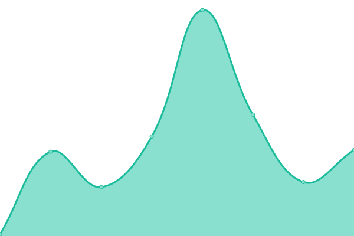
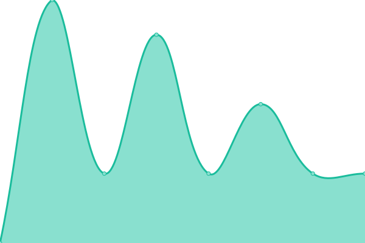

# [📈 Live Status](https://kijimaD.github.io/roam_upptime): <!--live status--> **🟧 Partial outage**

This repository contains the open-source uptime monitor and status page for [Kijima Daigo](https://kijimad.github.io/roam/), powered by [Upptime](https://github.com/upptime/upptime).

With [Upptime](https://upptime.js.org), you can get your own unlimited and free uptime monitor and status page, powered entirely by a GitHub repository. We use [Issues](https://github.com/kijimaD/roam_upptime/issues) as incident reports, [Actions](https://github.com/kijimaD/roam_upptime/actions) as uptime monitors, and [Pages](https://kijimaD.github.io/roam_upptime) for the status page.

<!--start: status pages-->
<!-- This summary is generated by Upptime (https://github.com/upptime/upptime) -->
<!-- Do not edit this manually, your changes will be overwritten -->
<!-- prettier-ignore -->
| URL | Status | History | Response Time | Uptime |
| --- | ------ | ------- | ------------- | ------ |
|  [production(gh domain)](https://kijimad.github.io/roam/) | 🟩 Up | [production-gh-domain.yml](https://github.com/kijimaD/roam_upptime/commits/HEAD/history/production-gh-domain.yml) | 

 97ms
     
 | 

<a href="https://kijimaD.github.io/roam_upptime/history/production-gh-domain">100.00%</a>
    

|  [production(custom domain)](https://www.kijimad.com/) | 🟥 Down | [production-custom-domain.yml](https://github.com/kijimaD/roam_upptime/commits/HEAD/history/production-custom-domain.yml) | 

 0ms
     
 | 

<a href="https://kijimaD.github.io/roam_upptime/history/production-custom-domain">0.00%</a>
    

<!--end: status pages-->

[**Visit our status website →**](https://kijimaD.github.io/roam_upptime)

## 📄 License

- Powered by: [Upptime](https://github.com/upptime/upptime)
- Code: [MIT](./LICENSE) © [Kijima Daigo](https://kijimad.github.io/roam/)
- Data in the `./history` directory: [Open Database License](https://opendatacommons.org/licenses/odbl/1-0/)
